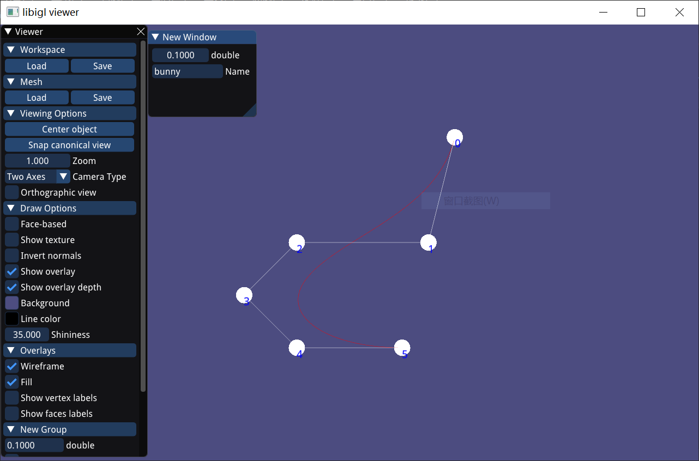

# Window显示窗口模块
相关文件：
- Window.h
- Window.cpp
  
libigl中可以为显示窗口添加菜单栏，具体实现见[View Menu](https://libigl.github.io/tutorial/#viewer-menu)，具体显示效果如下图：


为了使用这个功能，如果仅仅在`main.cpp`中添加，会使得代码非常混乱，为了解决这个问题，本软件进行了封装模块化，具体见`Window`类的实现。

有了`Window`模块，代码可非常简洁明了。
以`Test.cpp`中的绘制简单B样条曲线为例，可以很简单的通过`Window`模块显示。
```cpp
void Test::test_nurbs()
{
	// bezier curve
	NURBSCurve nurbs;
	nurbs.loadNURBS("../out/nurbs/bezier1.cpt");
	nurbs.draw(Window::viewer);
    // 使用Window模块
	Window w;
	w.launch();	
}
```
`Window`模块的具体实现见代码。
