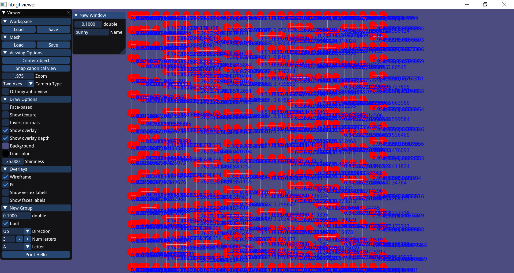
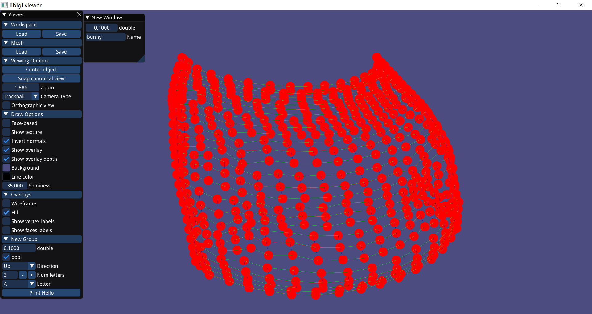
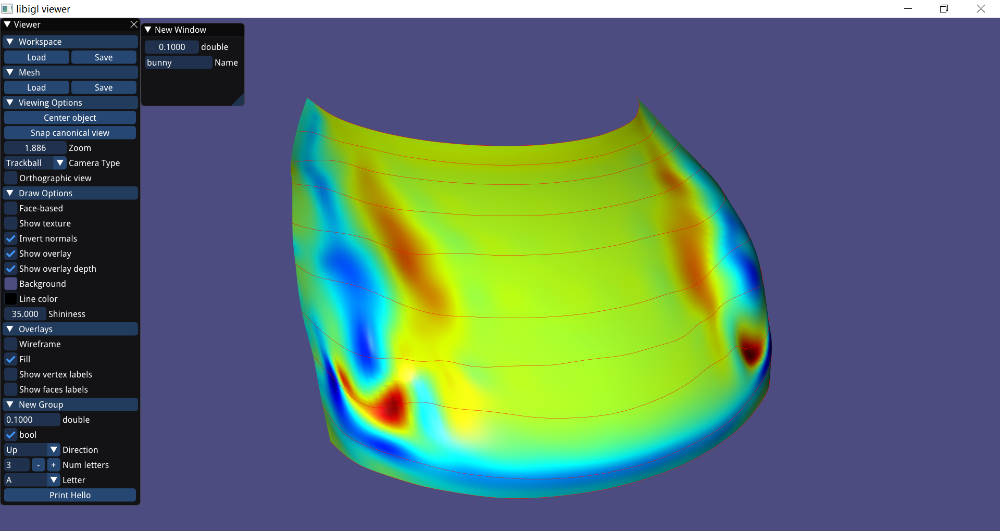

# Tspline数据结构及常用API
相关文件：
- array.hpp:
- node.hpp:  
- mesh.hpp:  
- utility.h
- utility.cpp

其中`Array,Node`为T样条的辅助数据结构。

设T样条曲面一个节点处的节点向量为$\boldsymbol{u} = [u_{i_0},u_{i_1},u_{i_2},u_{i_3},u_{i_4}], \boldsymbol{v} = [v_{i_0},v_{i_1},v_{i_2},v_{i_3},v_{i_4}]$，
则曲面$S(u,v)$的方程为：
$$
S(u,v) = \sum_{i=0}^nP_iN[u_{i_0},u_{i_1},u_{i_2},u_{i_3},u_{i_4}](u)N[v_{i_0},v_{i_1},v_{i_2},v_{i_3},v_{i_4}](v)
$$

为了表示T样条，需要表示T样条的T网格，关键是表示每个T节点和T节点之间的连接关系，为此，本软件使用Node和Mesh两个数据结构，能够很方便的表示T样条。

### Node
```cpp
template<class T>
    class Node{
            friend class Mesh<T>;
        public:
            Node(int num=0):order(num),data(),s(),t(),adj(),valid(true){}
            ~Node();
        public:
            int                 order;   // the order of node: 1,2,3,...
            T                   data;	 // point coordinate
            Array<double,5>        s;    // knot vector of s-direction
            Array<double,5>        t;    // knot vector of s-direction
            Array<Node<T>*,4>   adj;     // pointer of lower, right,upper,left node

            bool                valid;
    };
```
`Node`类用于表示T节点，包含了每个节点的标号、控制点坐标、$s,t$方向的节点向量和相邻的下、右、上、左方向的节点。

### Mesh
```cpp
class Mesh{
		private:
			Mesh& operator=(const Mesh&){}
        public:
			Mesh():width(1.0),height(1.0),id(-1){}
			Mesh(const Mesh& other);// deep copy
			~Mesh();
			
		public:
			// organizing node in a good data structure 
			map<double, map<double, Node<T>*> > s_map; // s_map[s][t]
			map<double, map<double, Node<T>*> > t_map; // t_map[t][s]

			vector<Node<T>*>    nodes;
			int id;
		private:
            // 边界参数值
			double width;
			double height;

            // 离散得到的三角网格
			Eigen::MatrixXd mesh_V;  
			Eigen::MatrixXi mesh_F;
			Viewer* viewer;
			vector<map<double, double>> s_cache; // 缓存每个节点计算过的s方向基函数值
			vector<map<double, double>> t_cache; // 缓存每个节点计算过的t方向基函数值
			
};
```
`Mesh`通过`vector<Node<T>*> nodes`顺序存储了所有的T节点，
又通过`s_map,t_map`的特殊结构组织了T样条的所有节点，能够很方便由`s,t`参数值获得相应的节点。

### Tspline文件格式
以下几个函数用于读取和保存Tspline，以及将T样条曲面离散保存为三角网格、四边网格。
```cpp
// load 
int loadMesh(string);
// save
int saveMesh(string);
// 按resolution间隔划分参数域，将曲面离散为三角网格并保存为OBJ格式
void saveAsObj(string, double resolution=0.01);
// 按resolution间隔划分参数域，将曲面离散为四边网格并保存为OBJ格式
void saveAsQuadObj(string, double resolution = 0.01);
```
T样条详细的文件格式见`loadMesh,saveMesh`的具体实现，具体例子见`out/tspline`目录下的文件。

### T样条显示
显示相关函数如下：
```cpp
void drawTmesh();
```

```cpp
void drawControlpolygon();
```

```cpp
void drawSurface(double resolution = 0.01);
```

```cpp
void draw(bool tmesh, bool polygon, bool surface,double resolution = 0.01);
```
调用`draw`函数可以通过`tmesh,polygon,surface`3个布尔变量控制显示T-preimage,T样条控制网格，T样条曲面。在本软件中，这些切换可以通过键盘操作，详情见下一节。


