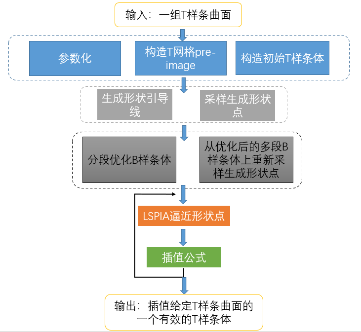

# VolumePiaMethod
相关文件：
- VolumePiaMethod.h
- VolumePiaMethod.cpp
  
**VolumePiaMethod**是基于引导线、LSPIA、优化的T样条体蒙皮方法，用于生成一个既满足插值性，且雅克比值全为正的适用于等几何分析的T样条体。

该方法的具体算法步骤如下：


由于该步骤与**VolumeSkinning**有重合部分，因此设计时VolumePiaMethod类继承自VolumeSkinning类。

### VolumePiaMethod类
```cpp
#ifndef VOLUMEPIAMETHOD_H
#define VOLUMEPIAMETHOD_H

#include "VolumeSkinning.h"
#include "FitPoint.hpp"
#include "BsplineVolume.h"
class VolumePiaMethod :public VolumeSkinning {
public:
	VolumePiaMethod(const vector<Mesh3d>& _surfaces,int _maxIterNum=100,double _eps = 1e-5)
		:VolumeSkinning(_surfaces),maxIterNum(_maxIterNum),eps(_eps) {

	}

	void calculate() override;  // 计算流程


public:
	// 设置辅助点
	void set_helper_points(const MatrixXd& points) {
		helper_points.resize(points.rows());
		for (int i = 0; i < points.rows(); i++) {
			helper_points[i].origin.fromVectorXd(points.row(i));
		}
		(*viewer).data().add_points(points, red);
	}
	// 将辅助点参数化
	void param_helper_points(Point3d& low, Point3d& high);
	void sample_fitPoints_2();
	void sample_fitPoints_bvolume();
	// 生成形状引导线，分段优化生成Jacobian值全为正的B样条体，采样用于拟合的点
	void sample_fitPoints_multiVolume();
	void sample_fitPoints();
	void fit();
	void pia();
	void cal_basis_cache();

private:
	const int maxIterNum;
	const double eps;
	double error;
	vector<FitPoint3D> fitPoints;
	vector<FitPoint3D> surface_points;
	vector<FitPoint3D> inter_points;
	vector<FitPoint3D> helper_points;
	vector<vector<double>> basis_cache; // (B_i(t_j)
	vector<double> basis_cache_sum; // sum_j (B_i(t_j)
};
#endif // !VOLUMEPIAMETHOD_H
```

`calculate`中定义了具体的处理流程：
```cpp
void VolumePiaMethod::calculate()
{
	parameterize();
	init();
	insert();
	// 生成形状引导线，分段优化生成Jacobian值全为正的B样条体，采样用于拟合的点
	sample_fitPoints_multiVolume(); 
	fitPoints = surface_points;
	fitPoints.insert(fitPoints.end(), inter_points.begin(), inter_points.end());
	cal_basis_cache(); // 计算基函数在fitPoints参数位置的值， 这样在fit()和pia()时不需要再重新计算
	cout << "finished cal_basis_cache() " << endl;
	fit();
	cout << "finished fit() " << endl;
	// lspia拟合采样得到的数据点
	pia();
	cout << "finished pia() " << endl;
	// 更新控制点以满足插值性
	update();
	cout << "finished update() " << endl;

	for (int i = 0; i < 5; i++) {
		fit();
		cout << "finished fit() " << endl;
		pia();
		cout << "finished pia() " << endl;
		update();
		cout << "finished update() " << endl;
	}
}
```
各个步骤具体实现见代码。

### 使用方法
`main.cpp`中包含了一些T样条体蒙皮的测试用例，可参照使用。
```cpp
Test::test_VolumeSkinning("tooth", 3);
Test::test_VolumeSkinning("venus", 3e-3);
Test::test_VolumeSkinning("isis", 5e-3);
Test::test_VolumeSkinning("isis", 1e-2);
Test::test_VolumeSkinning("moai", 0.04);
Test::test_VolumeSkinning("moai_new", 0.03);
Test::test_VolumeSkinning("moai_fitbspline", 0.04);
Test::test_VolumeSkinning("Ssolid", 0.05);
Test::test_VolumeSkinning("head", 0.01);
Test::test_VolumeSkinning("duck", 2);
Test::test_VolumeSkinning("duck_new", 2);
```